# Captures d'écran
## 1. Script
- Un script unique permet de générer l'ensemble de l'épisode.
- Il n'utilise que les images provenant des copies de sauvegarde des DVD de différentes éditions
- Il utilise les fichiers de configurations définis manuellement et avec les outils présentés ci-dessous
- Il permet de regénérer un épisode lorsque les paramètres sont modifiés (filtres) et qui permettent une amélioration au fil du temps.

- Ce script est codé en python et utilise des modules python (numpy, OpenCV, Scikit-image), d'autres programmes (FFmpeg, MKVToolNix)
    * exemple pour le générique de début uniquement (ici, désentrelacement uniquement, ce qui permet de vérifier le montage vidéo très rapidement(son, remplacements d'images))
    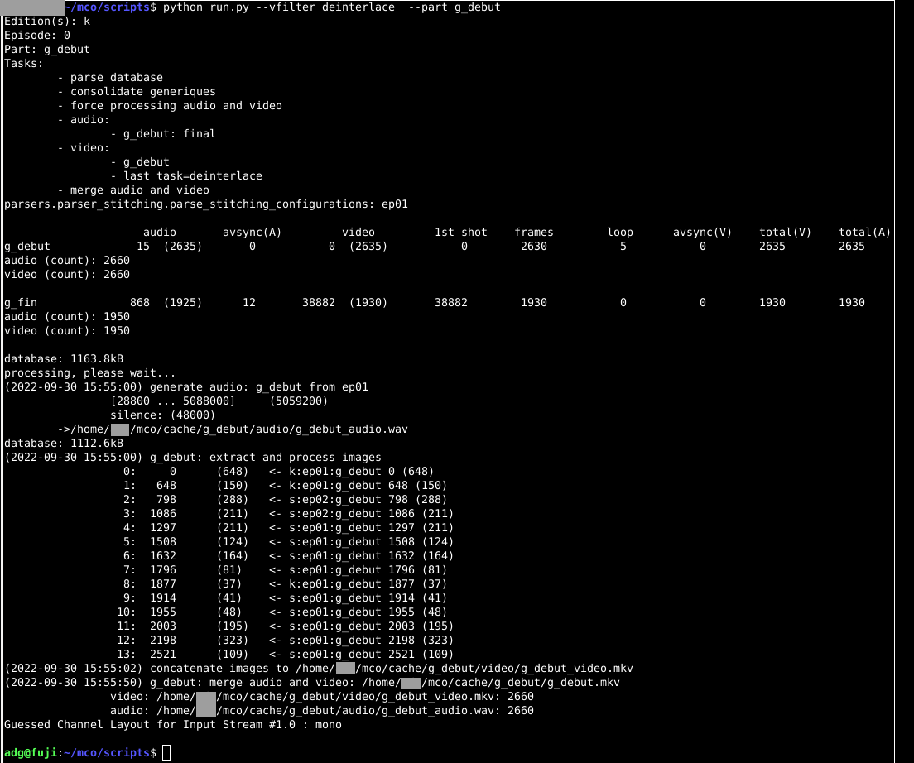

&nbsp;

&nbsp;

## 2. Outils
### 2.1 Visualiseur d'images
- Utilisé  pour comparer les différentes éditions, épisodes, parties, étapes de filtrage, filtres différents,  etc.
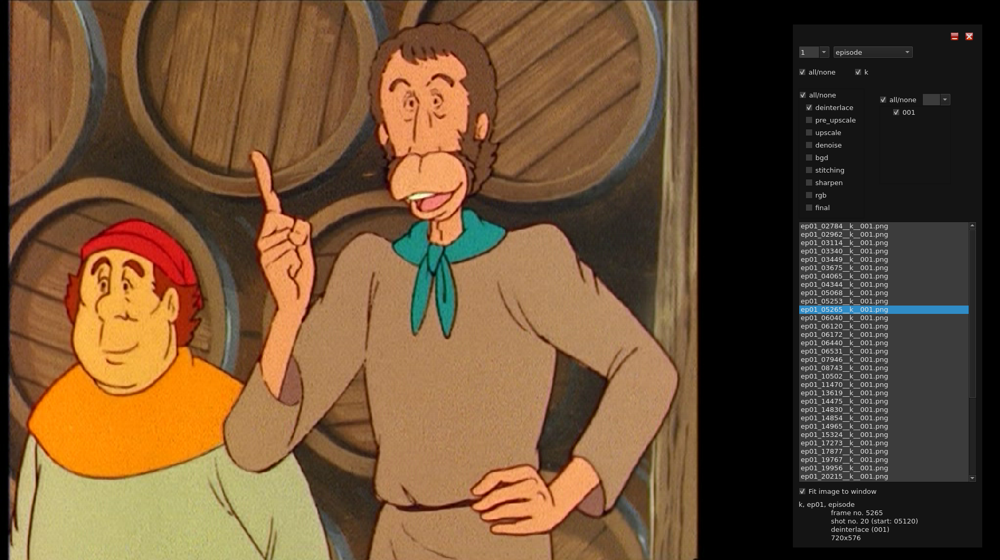

&nbsp;

### 2.2 Editeur de courbes RGB
- Permet de créer et d'associer des courbes RGB pour chque plan
(exemple brut sur une image lambda)
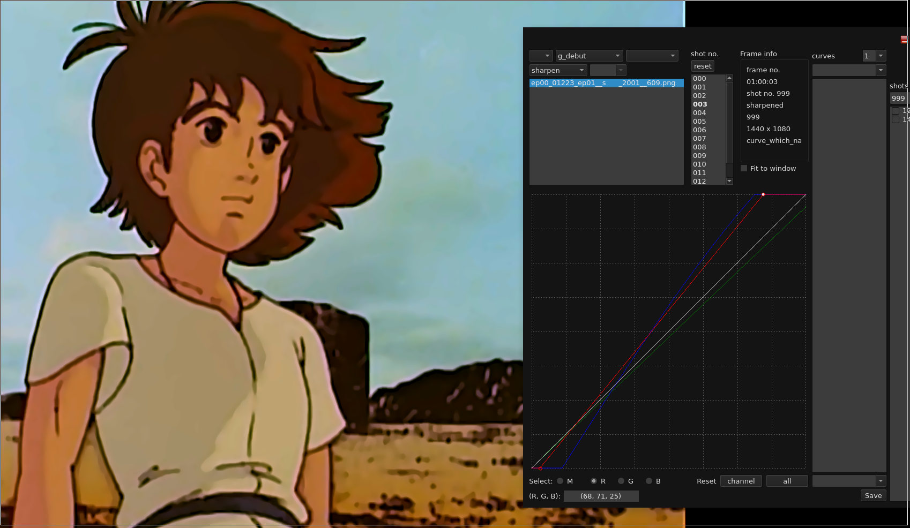

&nbsp;

### 2.3 Editeur vidéo
- Permet de définir les images à remplacer (par une suivante/précédente)
- Utilisé pour définir le rognage des images (crop) à la fin
- Permet de visualiser les épisodes/parties par plans (trame ou lecture)
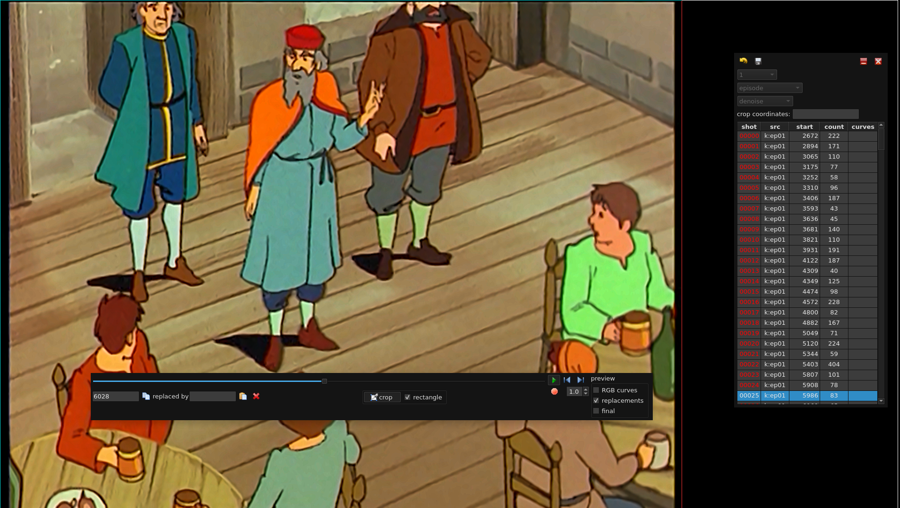

&nbsp;

### 2.4 Editeur pour la stabilisation et la superposition d'images
- Certains changements de plan sur l'édition utilisée sont désagréables et d'autres plans sont trop rognés. Même si la superposition d'images de différentes éditions n'est pas parfaite, elle permet d'améliorer le ressenti. Cette opération pourra être optionnelle pour la génération finale selon le ressenti de chacun
- Permet de calculer les décalages d'images pour la stabilisation d'un plan (partie de plan)
- La stabilisation est dépendante de la superposition des images de différentes éditions. Sinon, il faudrait rogner l'image en hauteur ce qui est très dommageable étant donné que l'édition utilisée est déjà trop "rognée" par rapport aux autres.
- La superposition nécessite de modifier (stretching) l'image d'arrière plan car le ratio/orientation est différent entre les éditions (scan de la pellicule sont différents!)
- Les couleurs sont différentes entre les éditions, il faut pouvoir modifier l'histogramme de l'arrière plan pour que la superposition ne se voit pas (ou très légèrement que ça ne perturbe pas l'oeil)

    * Avant la modification de l'histogramme (après modification, avant amélioration de la netteté, corrections RGB de l'ensemble et rognage...)
    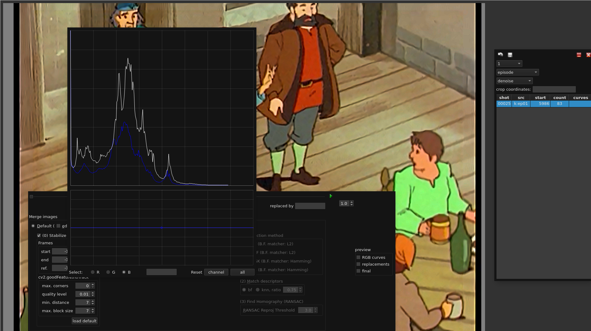
    * Après la modification de l'histogramme(avant amélioration de la netteté, corrections RGB de l'ensemble et rognage...)
    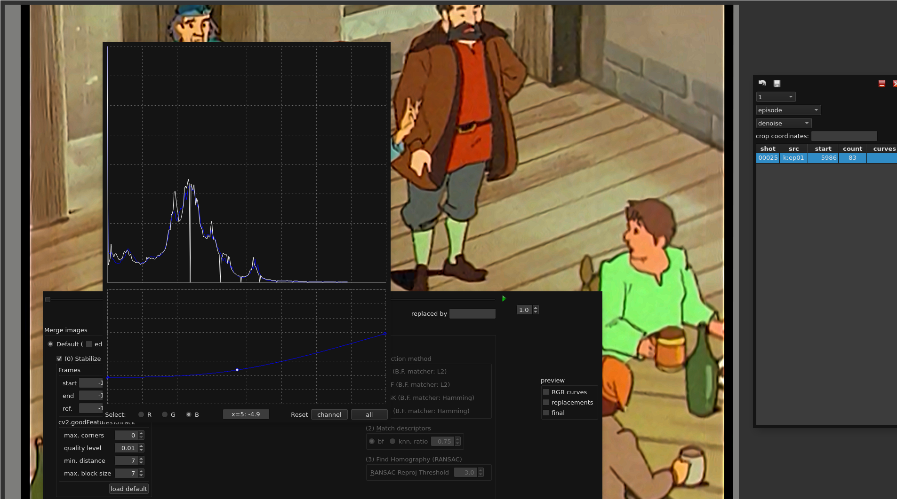

&nbsp;

## 3. Fichiers de configurations
- Chaque répertoire contient les configurations pour générer un épisode
- Certains fichiers sont écrits manuellement, d'autre par les outils d'éditions
- Exemples:
    * Fichier de configuration commun d'un épisode (édité manuellement)

        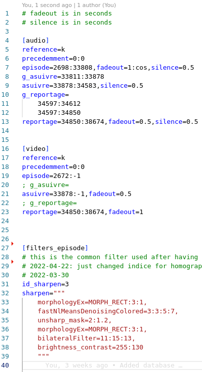

    * Fichier de configuration commun du générique de fin (édité manuellement)

        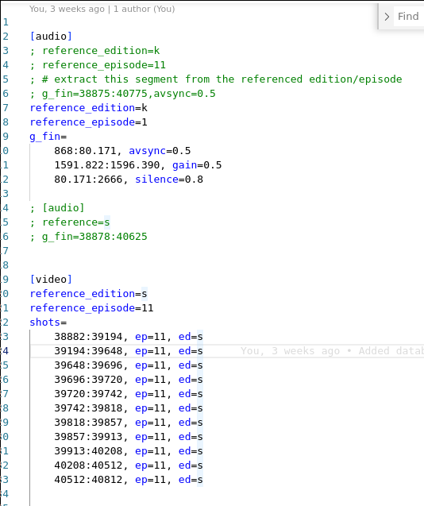

    * Répertoires où sont stockés les fichiers de configuration

        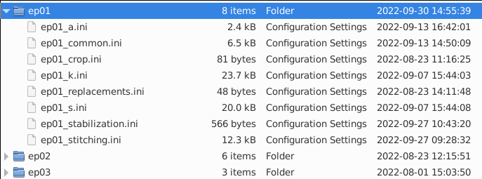

    * Fichier de configuration pour la modification de l'image d'arrière plan

        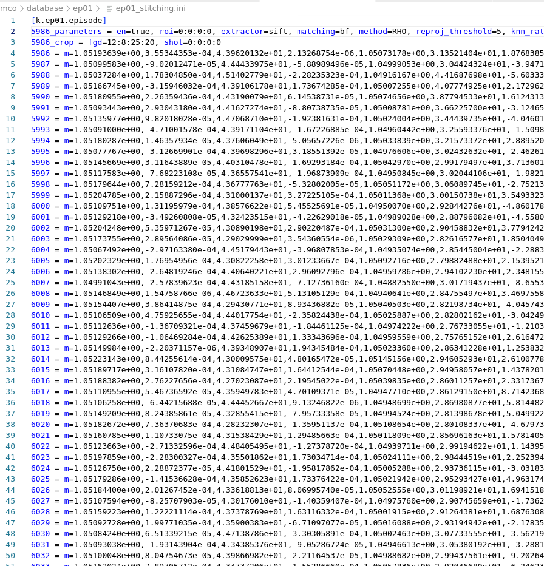

    * Fichier de configuration pour la stabilisation (uniquement le début du plan pour cet exemple, le reste du plan étant suffisemment stable)

        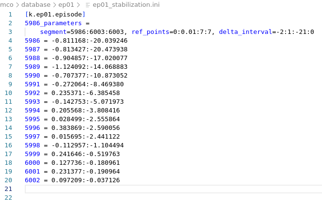

&nbsp;

## 4. Répertoires
- Fichiers et répertoires générés automatiquement par le script
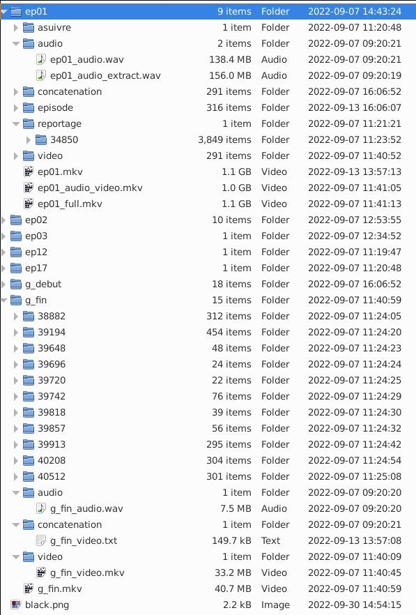
